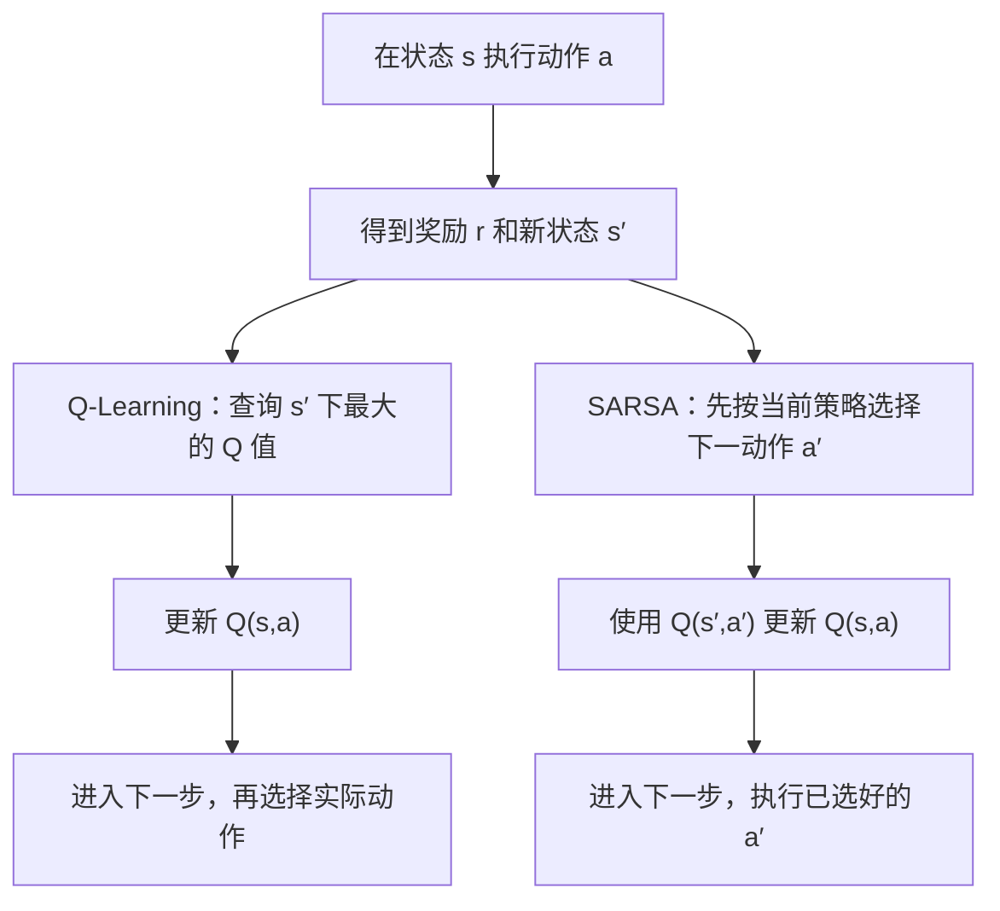

# RL
# 和我解释一下在强化学习中Q Learning和Sarsa两个算法的具体每一步逻辑是如何实现的

> 和我解释一下在强化学习中Q Learning和Sarsa两个算法的具体每一步逻辑是如何实现的

<details><summary>14 previous messages</summary>

> Stream error
>
> Reconnecting 5/5
> request timed out
>
> 我会先按“每一步怎样选动作、怎样更新 Q 值”拆解两个算法，再用一个数值例子说明它们的关键差别。
>
> 我会核对 Sutton 与 Barto 教材中的更新公式，重点确认动作选择顺序和终止状态的处理；下面会用流程图和伪代码逐步解释。
>
> <details><summary>Searched the web</summary>
>
> Searched the web for `site.incompleteideas.net book Sutton Barto Sarsa Q-learning 6.4 6.5 pdf`
>
> Searched the web for `https://incompleteideas.net/book/RLbook2020.pdf`
>
> </details>
>
> 教材 PDF 暂时无法读取，我会尝试作者提供的在线章节。核对的关键是：Q-Learning 用下一状态的最大 Q 值更新，SARSA 用下一步已选动作的 Q 值更新。
>
> <details><summary>Searched the web</summary>
>
> Searched the web for `http://incompleteideas.net/book/ebook/node64.html`
>
> Searched the web for `site.davidsilver.uk wp-content lecture5 Q-Learning Sarsa ...`
>
> </details>
>
> 我会用 visualize 技能组织对照流程，并改用 David Silver 的课程材料核对公式。读取技能的命令是：
>
> `Get-Content -LiteralPath 'C:\Users\14494\.codex\plugins\cache\openai-bundled\visualize\1.0.45\skills\visualize\SKILL.md'`
>
> <details><summary>Searched the web</summary>
>
> Searched the web for `https://www.davidsilver.uk/wp-content/uploads/2020/03/control.pdf`
>
> </details>
>
> 流程图适合直接呈现两者的执行顺序，无需创建文件。上次技能输出被截断，我会补读后半部分，同时只提取课程材料中与 SARSA、Q-Learning 有关的段落。
>
> `Get-Content -LiteralPath 'C:\Users\14494\.codex\plugins\cache\openai-bundled\visualize\1.0.45\skills\visualize\SKILL.md' | Select-Object -Skip 145`
>
> <details><summary>Ran a command, searched the web</summary>
>
> Searched the web for `https://www.davidsilver.uk/wp-content/uploads/2020/03/control.pdf`
>
> - Ran `Get-Content -LiteralPath 'C:\Users\14494\.codex\plugins\cache\openai-bundled\visualize\1.0.45\skills\visualize\SKILL.md' | Select-Object -Skip 145`
>
> </details>
>
> 在线核对已找到 Stanford 的课程教材。接下来只核对相关公式，并补读被截断的技能段落；然后直接给你完整解释。
>
> `Get-Content -LiteralPath 'C:\Users\14494\.codex\plugins\cache\openai-bundled\visualize\1.0.45\skills\visualize\SKILL.md' | Select-Object -Skip 110 -First 35`
>
> <details><summary>Ran a command, searched the web</summary>
>
> Searched the web for `'SARSA' in https://stanford.edu/~ashlearn/RLForFinanceBook/chapter11.pdf`
>
> - Ran `Get-Content -LiteralPath 'C:\Users\14494\.codex\plugins\cache\openai-bundled\visualize\1.0.45\skills\visualize\SKILL.md' | Select-Object -Skip 110 -First 35`
>
> </details>
>
> 两者都在学习一个问题：**“在状态 \(s\) 下执行动作 \(a\)，长期来看能得到多少奖励？”**
>
> 核心区别在于，更新时怎样估计下一步的价值：
>
> - **Q-Learning：使用下一状态中最大的 Q 值。**
> - **SARSA：使用下一状态中，实际选出的下一动作的 Q 值。**
>
> 下面用最基础的**表格版算法**讲清每一步：状态和动作都是离散的，Q 值存储在一张表里。
>
> 先理解两者共用的几个量：
>
> | 符号 | 含义 | 例如走迷宫 |
> |---|---|---|
> | \(s\) | 当前状态 | 当前所在格子 |
> | \(a\) | 当前动作 | 向右走 |
> | \(r\) | 执行动作后得到的奖励 | 到达终点得到 \(+10\) |
> | \(s'\) | 执行动作后的新状态 | 右边的格子 |
> | \(Q(s,a)\) | 从 \(s\) 执行 \(a\) 后，未来累计折扣奖励的估计 | 在这个格子向右走有多好 |
> | \(\alpha\) | 学习率，控制一次修改多少 | \(0.1\) |
> | \(\gamma\) | 折扣因子，控制未来奖励的权重 | \(0.9\) |
> | \(\varepsilon\) | 随机探索的概率 | \(0.1\) |
>
> 注意，**Q 值包含未来奖励，不只是这一步的奖励。**
>
> 例如，某次训练中的 Q 表可能是：
>
> | 状态 | 向上 | 向下 | 向左 | 向右 |
> |---|---:|---:|---:|---:|
> | 格子 A | 1 | 2 | 0 | 5 |
> | 格子 B | 3 | 0 | 4 | 1 |
>
> Stream error
>
> Reconnecting 1/5
> stream disconnected before completion: Transport error: network error: error decoding response body
</details>

两者都在反复做同一件事：**执行动作，观察奖励，再修正这个动作的价值。核心差别是：估计“下一步的价值”时，Q-Learning 取最大 Q 值，SARSA 取下一步实际选中动作的 Q 值。**

下面用最容易理解的**表格版本**来讲：状态、动作都是离散的，每个“状态—动作”组合对应一个 Q 值。

先把共同的概念弄清楚：

| 符号 | 含义 | 例子 |
|---|---|---|
| \(s\) | 当前状态 | 机器人所在的格子 |
| \(a\) | 当前执行的动作 | 向右走 |
| \(r\) | 执行动作后收到的奖励 | 到达目标得 \(+10\) |
| \(s'\) | 执行动作后的新状态 | 右边的格子 |
| \(Q(s,a)\) | 在状态 \(s\) 执行动作 \(a\) 后，累计折扣回报的估计 | “从这里向右走，长期来看有多好” |
| \(\alpha\) | 学习率，决定每次修正多少 | 例如 \(0.1\) |
| \(\gamma\) | 折扣因子，决定多重视未来奖励 | 例如 \(0.9\) |
| \(\epsilon\) | 探索概率 | 例如 \(0.1\) |

注意：**Q 值包含对未来奖励的估计，不只是这一步的奖励。**

两者通常都用 \(\epsilon\)-greedy 选择实际执行的动作：

```text
以 ε 的概率：从可用动作中均匀随机选一个，进行探索
以 1−ε 的概率：选择当前 Q 值最大的动作
```

随机探索也可能选中最大 Q 值的动作；如果多个动作的 Q 值并列最大，可以从中随机选择。

两者的更新都能写成：

\[
\boxed{\text{新 Q 值}=\text{旧 Q 值}+\alpha(\text{学习目标}-\text{旧 Q 值})}
\]

意思是：根据新得到的信息，让旧估计向学习目标靠近一点。

**Q-Learning 的每一步逻辑如下。**

1. **初始化 Q 表。**
   例如，把所有 \(Q(s,a)\) 设为 \(0\)。Q 表在不同训练回合之间保留，持续积累经验。

2. **开始一个回合，得到初始状态 \(s\)。**
   比如把机器人放回起点。

3. **根据当前 Q 表，在 \(s\) 选择动作 \(a\)。**
   通常使用前面说的 \(\epsilon\)-greedy。

4. **执行 \(a\)，观察奖励 \(r\) 和新状态 \(s'\)。**
   这部分来自环境的真实反馈。

5. **计算学习目标，更新刚才的 \(Q(s,a)\)。**
   如果 \(s'\) 不是终止状态，查看 \(s'\) 下所有可用动作的 Q 值，取最大的一个：

   \[
   y=r+\gamma\max_b Q(s',b)
   \]

   然后更新：

   \[
   \boxed{
   Q(s,a)\leftarrow Q(s,a)+
   \alpha\left[r+\gamma\max_bQ(s',b)-Q(s,a)\right]
   }
   \]

   这里的 \(b\) 只是用来遍历下一状态的动作。**取最大值时不需要真的执行这些动作，只需要查 Q 表。**

   如果 \(s'\) 是真正的终止状态，后面没有奖励了，直接令 \(y=r\)。

6. **继续或结束回合。**
   未终止就令 \(s\leftarrow s'\)，回到第 3 步；终止则开始下一个回合。

对应的伪代码是：

```python
Q = 全部初始化为 0

for 每个训练回合:
    s = 环境重置()

    while True:
        a = epsilon_greedy(Q, s)
        s_next, r, terminal = 环境执行(a)

        if terminal:
            target = r
        else:
            target = r + gamma * max(Q[s_next, b] for b in 可用动作(s_next))

        Q[s, a] += alpha * (target - Q[s, a])

        if terminal:
            break

        s = s_next
```

Q-Learning 对未来的估计相当于：**“从下一状态开始，按当前估计最好的动作继续走，会得到多少回报？”** 实际探索时仍然可以随机选动作。

**SARSA 的每一步逻辑如下。**

SARSA 这个名字对应它更新时需要的五个量：

\[
\underbrace{s}_{S},\quad
\underbrace{a}_{A},\quad
\underbrace{r}_{R},\quad
\underbrace{s'}_{S},\quad
\underbrace{a'}_{A}
\]

其中 \(a'\) 是在下一状态中，按照当前行为策略选出的、下一步准备执行的动作。

1. **初始化 Q 表。**
   同样可以全部设为 \(0\)，并在回合之间保留。

2. **开始一个回合，得到初始状态 \(s\)，并选好第一个动作 \(a\)。**
   通常使用 \(\epsilon\)-greedy。

3. **执行当前已经选好的 \(a\)。**
   获得奖励 \(r\)、新状态 \(s'\) 和是否终止的信息。

4. **如果尚未终止，在 \(s'\) 先选好下一步动作 \(a'\)。**
   仍然使用 \(\epsilon\)-greedy。因此，\(a'\) 可能是最好的动作，也可能是探索选中的动作。

5. **用 \(a'\) 的 Q 值更新刚才的 \(Q(s,a)\)。**

   \[
   y=r+\gamma Q(s',a')
   \]

   \[
   \boxed{
   Q(s,a)\leftarrow Q(s,a)+
   \alpha\left[r+\gamma Q(s',a')-Q(s,a)\right]
   }
   \]

   如果 \(s'\) 是终止状态，不需要选择 \(a'\)，直接令 \(y=r\)。

6. **把状态和已选好的动作一起传给下一步。**

   \[
   s\leftarrow s',\qquad a\leftarrow a'
   \]

   然后回到第 3 步，执行这个 \(a\)。

对应的伪代码是：

```python
Q = 全部初始化为 0

for 每个训练回合:
    s = 环境重置()
    a = epsilon_greedy(Q, s)

    while True:
        s_next, r, terminal = 环境执行(a)

        if terminal:
            target = r
        else:
            a_next = epsilon_greedy(Q, s_next)
            target = r + gamma * Q[s_next, a_next]

        Q[s, a] += alpha * (target - Q[s, a])

        if terminal:
            break

        s = s_next
        a = a_next
```

这里最容易写错的是：**SARSA 用来更新的 `a_next`，必须沿用到下一次执行。不要更新后又重新随机选一个动作。**

两者处理一个非终止步骤的顺序可以这样对照：



**用同一个数值例子算一次，就能看到差别。**

假设训练到某一时刻：

\[
Q(s,a)=2,\qquad r=1,\qquad \alpha=0.1,\qquad\gamma=0.9
\]

新状态 \(s'\) 有两个动作：

| 下一步动作 | 当前 Q 值 |
|---|---:|
| 向左 | 10 |
| 向右 | 4 |

假设下一步由于探索，选中了“向右”。

Q-Learning 仍然取最大值 \(10\)：

\[
y_Q=1+0.9\times10=10
\]

\[
Q_{\text{新}}(s,a)=2+0.1(10-2)=\boxed{2.8}
\]

SARSA 使用实际选中动作“向右”的 Q 值 \(4\)：

\[
y_S=1+0.9\times4=4.6
\]

\[
Q_{\text{新}}(s,a)=2+0.1(4.6-2)=\boxed{2.26}
\]

它们收到的是相同的当前奖励，区别来自**对后续行动的估计**。如果 SARSA 这次恰好选中最大 Q 值的动作，那么在相同的更新前 Q 表和转移下，两者这一次的更新结果也相同。

这也解释了两个术语：

- **Q-Learning 是 off-policy（异策略）：**实际选动作可以使用带探索的策略，但更新目标使用贪心策略的最大 Q 值。
- **SARSA 是 on-policy（同策略）：**下一动作按照当前行为策略选择，更新目标也使用这个动作的 Q 值。[Stanford 课程教材：TD Control](https://stanford.edu/~ashlearn/RLForFinanceBook/chapter11.pdf)

最后，初始 Q 表全部是 \(0\) 也能学习：接近终点的动作先从真实奖励中得到更新，之后它们的 Q 值又进入更早步骤的学习目标。经过反复访问，终点奖励的影响逐渐向前传播。**两个算法都每走一步就能更新，表格版每次只改当前的 \(Q(s,a)\) 那一格，无需等整局结束。**
